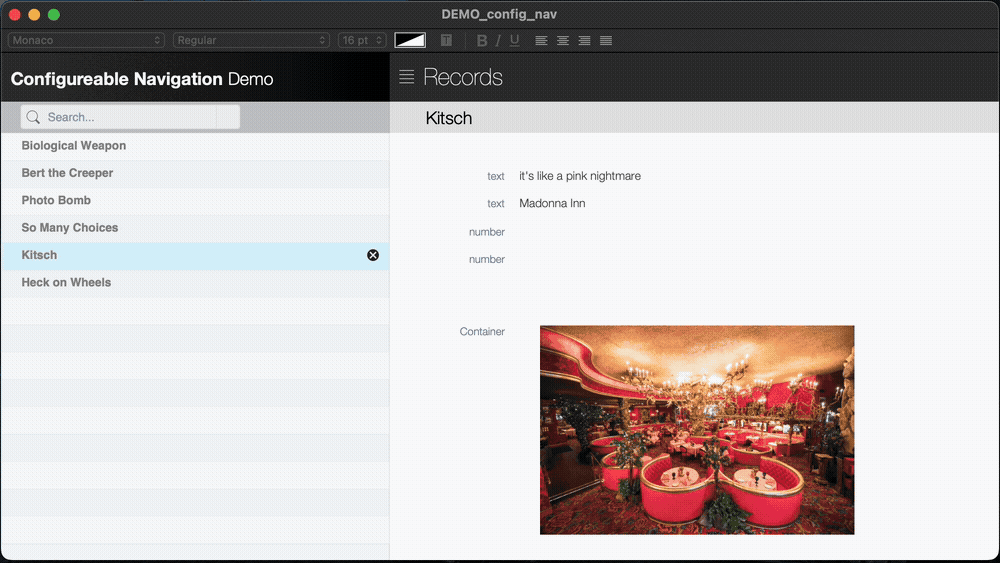
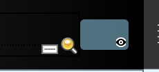

# Configurable Navigation

Proof of concept for slide out drawer interfaces in FileMaker Pro, with the option for a modal drawer.

[DEMO_config_nav.fmp12](DEMO_config_nav.fmp12)

## Navigation Components
The technique is driven by a pair of calculated button bars, and a pair of scripts. The button bar repitation names, and passed script parameters, are drawn from repeating fields populated by one of these scripts. The other script provides the call to action, when selecting a navigation menu item.

### Popover: Layout Selection
The heart of the solution is in the calculated button bar, nested in a popover. The popover is a stand-in for a pop-up menu. The button names are drawn from a repeating field, as are the layout IDs passed as a script parameter. They popover is opened via script, with the parent button hidden.

### Button Bar: Layout Indicator
The button bar segments here are have calculated names corresponding to the stored layout names in a repeating field. The same field is referenced in the layout selction button bar. An equivalent repeating field stores the Layout IDs to be included in the selection menu.

A visibility calculation on the button bar segments hides all but one segement, based on the Layout ID of the current layout.

The following custom function derives that ID:

    /* __________________________________________________

    NAME:	        LayoutID ( )
    PURPOSE:    Returns the Layout ID of the current layout.
    HISTORY:
	    19 Jul 2024, 23hr47PST — Lon Cook : created
    */

    Let ([
	  #_layout_number	= Get ( LayoutNumber )
	; #_layout_ids		= LayoutIDs ( Get ( FileName ) )
	];

    GetValue ( #_layout_ids ; #_layout_number )

    )

### Layout Admin Layout
A script is run when the solution is run. It populates the rows in this layout, and refreshes the repeating fields that drive the calculated navigation menu. From this layout, layouts are selectewd to be included in the navigation menu, and in what order they are to appear.

This layout, and any additions por removals to the navigation menu, are refreshed when the file is opened. A refresh also can be triggered by calling the refresh script (e.g. button on the layout).

## Layout Object Visibility
Objects, like sliding drawers and popovers, can get lost on an interface, when not visible. We can do ourselves a favor and make these objects visible in Layout Mode. Underlying objects are not obscured, while remaining readily apparent themselves. The formatting applied here is a transparent cyan.

### Visibility Calculation
For objects you dont want to render at all, but still be able to find in Layout Mode, we turn to the visibilty calculation; also known as "Hide object when".

In this file, the navigation menu is driven by a popover object, which are ordinarily called by a button. Here we are opening the popover object via script. We want the popover, but dont need the button it's attached to. We still need to find the button, when in Layout Mode, so formatting is applied to the object to help it standout in Layout Mode (example: semi-transparent cyan).

The visibility calculation is as follows:

    Get ( WindowMode ) ≠ 4

This also works well for leaving developer notes, only visible in Layout Mode.

## Future Development
With further development, it should be possible to integrate native extended privilege access to layouts.

* Virtual value list of privilege sets
* In interface assigning of privilege set access to layouts
* Native FileMaker security respect of those assignments
    - Would this be insecure?
    - Maybe not allow assigning of [full access] privilege sets?
    - Maybe only allow access to the AAdmin layout from [full access] privilege sets?
* Currently, skipping numbers in the sort of menu visble layouts results in a gap in the menu. This needs to be resolved. Layout inclusion based on privilege set assignment would result in the same gaps.